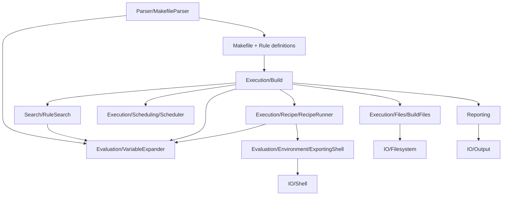

# Makefile engine

This directory implements make semantics: variable evaluation, rule selection,
dependency updates, and recipe execution. Text parsing lives in
[`src/Parser`](../Parser/); operating-system adapters and the CLI live in
[`src/Console`](../Console/).

Start with [`Makefile.php`](Makefile.php), which holds the parsed definitions,
then [`Execution/Build.php`](Execution/Build.php), which coordinates a build.
`Builtins.php` supplies default variables and rules. `MakefileErrorException.php`
is the common semantic error type.

## Responsibilities

| Directory | Question it answers | Main classes |
| --- | --- | --- |
| `Evaluation/` | What does an expression mean in the current variable scope? | `VariableExpander`, `Functions`, `EvaluationContext`, `VariableScope` |
| `Evaluation/Environment/` | Which variables reach a shell command? | `Exports`, `EnvironmentState`, `ExportingShell` |
| `Evaluation/Module/` | How do loaded functions and Guile participate in evaluation? | `Modules`, `LoadedModule`, `ModuleFunction` |
| `Rule/` | What are a target, its prerequisites, and its recipe? | `Target`, `BuildRule`, `PatternRule`, `Prerequisites`, `Recipe` |
| `Search/` | Which rule and file path can satisfy this target? | `RuleSearch`, `ImplicitCandidate`, `SearchPaths`, `SearchState` |
| `Execution/` | Which dependencies need updating, and what is the overall result? | `Build`, `BuildState`, `BuildPath`, `UpdateResult`, `ExecutionOptions` |
| `Execution/Files/` | Is a file out of date, and should it survive the build? | `BuildFiles`, `FilePolicy`, `FileTable`, `FileOptions` |
| `Execution/Recipe/` | How is a recipe expanded and executed? | `RecipeRunner`, `Command`, `ExpandedCommand`, `CommandResult` |
| `Execution/Scheduling/` | Which dependency tasks may advance or wait? | `Scheduler`, `BuildTask`, `Suspension`, `DependencyOrder`, `ParallelOptions` |
| `Reporting/` | How are failures, debug events, and rebuild reasons explained? | `Diagnostics`, `DebugTrace`, `RecipeTrace`, `ReportingOptions` |
| `IO/` | What services does the engine need from its host? | `Filesystem`, `Shell`, `Output`, `RecipeOutput`, `JobSlots`, `ModuleHost` |

## Following a build

The diagram shows the main runtime collaborations, not a strict dependency
hierarchy. Evaluation is used both while reading the Makefile and during a build.

1. `Parser/MakefileParser` reads definitions using `Evaluation` and constructs a
   `Makefile`. This is not a fully expanded build plan: recursive variables and
   secondary prerequisite expressions can remain deferred.
2. `Build::run()` starts from the requested goals. `Build::remake()` uses the same
   engine to update input Makefiles before ordinary goals are built.
3. `Build::update()` walks dependencies. `RuleSearch::resolve()` selects explicit
   or implicit rules and consults search paths. `SecondaryExpansion` and
   `ExtraPrerequisites` evaluate prerequisites in their applicable contexts.
4. `BuildFiles` supplies timestamps and rebuild decisions. `BuildState` records
   shared results; each `BuildPath` carries a branch's ancestors and variable
   scope. `Scheduler` coordinates concurrent traversals and job slots.
5. `RecipeRunner::run()` sets automatic variables and applies recipe options.
   `Command` retains the original expression; `ExpandedCommand` handles its
   expanded text and command prefixes. `ExportingShell` supplies the environment
   before delegating to `IO/Shell`.
6. `Reporting` explains failures and rebuild reasons. `BuildFiles::cleanup()`
   removes intermediate files according to `FilePolicy`.

## Boundaries that are easy to confuse

- `Rule/Recipe` is the shared recipe definition attached to one or more targets;
  `Execution/Recipe` contains the code that evaluates and runs its commands.
- `Search` determines how a target can be built. `Execution` decides whether to
  build it and coordinates its dependencies. Implicit search can itself inspect
  prerequisite rules, so it is not just a filesystem lookup.
- `Execution/Files` implements make's timestamp and intermediate-file policies.
  Actual filesystem access goes through `IO/Filesystem` to `Console/Filesystem`.
- `ExportingShell` belongs with environment evaluation because both `$(shell ...)`
  and recipes need it. It does not launch operating-system processes itself.
- `Evaluation/Module` implements make's extension semantics. `IO/ModuleHost` is
  the transport contract, implemented by `Console/Process/ModuleHost`.
- Exceptions stay with the operation they describe. `Reporting` formats them;
  it does not own build failures or interruption control flow.

These folders group responsibilities rather than independent layers. For
example, stored rules refer to commands, and evaluation can invoke shell
services. The enforced outer boundary is that `Makefile` does not depend on
`Parser`, `Console`, or concrete process libraries.

## Reading order

For the overall flow, read `Makefile` → `Build::run()` / `Build::update()` →
`RuleSearch::resolve()` → `BuildFiles::needsRebuild()` → `RecipeRunner::run()`.
Then follow the subsystem relevant to the behavior being changed:

- Variable behavior: `Variable` → `EvaluationContext` → `VariableScope` →
  `VariableExpander` → `Functions`.
- Parallel builds: `Scheduler` → `BuildTask` → `Suspension`; process waiting is
  implemented by `Console/Process/RecipeProcess` through this suspension contract.
- File lifetime: `BuildFiles` → `FilePolicy`; `FileTable` and `FileHash` preserve
  GNU make's traversal order for intermediate-file cleanup messages.

Keep broad build coordination in `Execution/Build.php`, and put subsystem
helpers and options next to the behavior they control. Add new folders when a
distinct responsibility emerges, rather than for each individual class.
