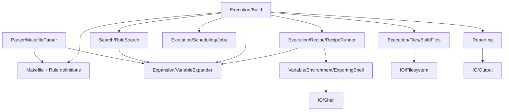

# Makefile engine

This directory implements make semantics: variable evaluation, rule selection,
dependency updates, and recipe execution. Text parsing lives in
[`src/Parser`](../Parser/); operating-system adapters and the CLI live in
[`src/Console`](../Console/).

Start with [`Makefile.php`](Makefile.php), which holds the parsed definitions,
then [`Execution/Build.php`](Execution/Build.php), which coordinates a build.
`Makefile` has no execution methods or evaluation context. The parser returns
`Parser/ParsedMakefile`, pairing definitions with the live `EvaluationContext`;
the caller passes both explicitly to `Build`.
[`MakefileBuilder.php`](MakefileBuilder.php) merges the rules read by the
parser: special targets, suffix rules, recipe overrides, and the default goal.
`Builtins.php` supplies default makefile names, variables, and rules, and the
variables describing an invocation. `MakefileErrorException.php`
is the common semantic error type.

## Definitions and operations

Keep this directory organized around GNU make concepts: rules, variables,
expansion, directory and implicit-rule search, target updates, and recipes.
The folders indicate where to look; they are not independent architectural
layers. A concept can keep its definitions and behavior together.

`Makefile` brings together the definitions read from makefiles:

| Makefile member | Meaning | Where to look |
| --- | --- | --- |
| `targets`, `targetsByName`, `patterns` | Targets and their explicit or pattern rules | `Rule/Target`, `Rule/BuildRule`, `Rule/PatternRule` |
| `defaultGoal` | The goal used when none is requested | `Makefile`, `MakefileBuilder` |
| `variables` | Global variable definitions at the end of reading | `Variable/Variable` |
| `targetVariables` | Target-specific and pattern-specific variable definitions | `Variable/TargetVariables` |
| `exports` | Export/unexport directives | `Variable/Environment/Exports` |
| `searchPaths` | Selective directory search definitions | `Search/SearchPaths` |

A `Rule/BuildRule` describes prerequisites and a recipe. `Rule/Recipe` and
`Rule/Command` retain recipe definitions.
`Execution/Build::update()` decides which targets to update, and
`Execution/Recipe/RecipeRunner::run()` runs their recipes.

For example, `TargetVariables` keeps both target-specific definitions and the
rules for applying them to a variable scope. `Exports` records directives and
computes the exported environment. `SearchPaths` records `vpath` directives and
performs directory search. These methods belong with the make concept they
implement.

## Where make's operations happen

| Directory | Question it answers | Main classes |
| --- | --- | --- |
| `Rule/` | What are a target, its prerequisites, and its recipe? | `Target`, `BuildRule`, `PatternRule`, `Prerequisites`, `Recipe`, `Command` |
| `Variable/` | What does an assignment define, and which variable applies here? | `Variable`, `Assignment`, `TargetVariables`, `VariableScope`, `AutomaticVariables` |
| `Expansion/` | How are variable references, functions, and deferred expressions expanded? | `VariableExpander`, `CommandExpander`, `ExpandedCommand`, `Functions`, `EvaluationContext`, `SecondaryExpansion` |
| `Variable/Environment/` | Which variables reach a shell command? | `Exports`, `EnvironmentState`, `ExportingShell` |
| `Expansion/LoadedObject/` | How do loaded objects and Guile participate in evaluation? | `LoadedObjects`, `LoadedObject`, `LoadedFunction`, `ExpansionApi` |
| `Search/` | Which rule and file path can satisfy this target? | `RuleSearch`, `ImplicitCandidate`, `SearchPaths`, `SearchState` |
| `Execution/` | Which dependencies need updating, and what is the overall result? | `Build`, `BuildState`, `BuildPath`, `UpdateResult`, `MakefileRemake`, `ExecutionOptions` |
| `Execution/Files/` | Is a file out of date, and should it survive the build? | `BuildFiles`, `FilePolicy`, `DeletionOrder`, `FileOptions` |
| `Execution/Recipe/` | How is a recipe expanded and executed? | `RecipeRunner`, `CommandRunner`, `CommandResult` |
| `Execution/Scheduling/` | Which target updates may proceed or wait? | `Jobs`, `TargetUpdate`, `Waiting`, `DependencyOrder`, `ParallelOptions` |
| `Invocation/` | Which options change reading, and how are they passed to sub-makes through `MAKEFLAGS`? | `InvocationOptions`, `MakeFlags`, `CommandVariables`, `ReversibleOptions` |
| `Reporting/` | How are failures, debug events, and rebuild reasons explained? | `Diagnostics`, `DebugTrace`, `RecipeTrace`, `ReportingOptions` |
| `IO/` | What are the contracts at the boundary with the host? | `Filesystem`, `SourceFiles`, `Shell`, `Output`, `RecipeOutput`, `JobSlots`, `DynamicObject`, `LoadedObjectApi` |

## Following a build

The diagram shows the main runtime collaborations, not a strict dependency
hierarchy. Expansion happens both while reading makefiles and while updating
targets.

```mermaid
flowchart TD
    Parser[Parser/MakefileParser] --> Definitions[Makefile + Rule definitions]
    Build[Execution/Build] --> Definitions
    Parser --> Expansion[Expansion/VariableExpander]
    Build --> Search[Search/RuleSearch]
    Build --> Files[Execution/Files/BuildFiles]
    Build --> Scheduling[Execution/Scheduling/Jobs]
    Build --> Recipe[Execution/Recipe/RecipeRunner]
    Search --> Expansion
    Build --> Expansion
    Recipe --> Expansion
    Recipe --> Environment[Variable/Environment/ExportingShell]
    Environment --> Shell[IO/Shell]
    Files --> Filesystem[IO/Filesystem]
    Build --> Reporting[Reporting]
    Reporting --> Output[IO/Output]
```

1. `Parser/MakefileParser` reads definitions using `Variable` and `Expansion`.
   It passes each `Rule/RuleDefinition` to `MakefileBuilder`, which constructs a
   `Makefile`.
   `Parser/ParsedMakefile` returns that definition and its evaluation context
   separately. This is not a fully expanded build plan: recursive variables and
   secondary prerequisite expressions can remain deferred.
2. `Build::run()` starts from the requested goals. Before that, `MakefileRemake`
   uses `Build::remake()` to update the `ReadFile` inputs and decides whether make
   must restart and read them again.
3. `Build::update()` walks dependencies. `RuleSearch::resolve()` selects explicit
   or implicit rules and consults search paths. `SecondaryExpansion` and
   `ExtraPrerequisites` evaluate prerequisites in their applicable contexts.
4. `BuildFiles` supplies timestamps and rebuild decisions. `BuildState` records
   shared results; each `BuildPath` carries a branch's ancestors and variable
   scope. `Jobs` coordinates concurrent target updates and job slots.
5. `RecipeRunner::run()` sets automatic variables and applies recipe options.
   `Rule/Command` retains the original expression. `Expansion/CommandExpander`
   produces an `Expansion/ExpandedCommand` containing text and original prefix
   metadata; `Execution/Recipe/CommandRunner` interprets prefixes and executes
   the expanded lines. `ExportingShell` supplies the environment before
   delegating to `IO/Shell`.
6. `Reporting` explains failures and rebuild reasons. `BuildFiles::cleanup()`
   removes intermediate files according to `FilePolicy`.

## State lifetimes

- `Makefile` holds definitions, including a snapshot of global variables at the
  end of reading. Build-time variable lookup uses the explicitly supplied
  `EvaluationContext`, not that snapshot.
- `EvaluationContext` belongs to one read and its subsequent build. The same
  context continues through makefile remaking and ordinary goals, preserving
  `$(eval ...)` mutations, shell status, exports, and loaded objects. It is not
  cloned at the read/build boundary. Restarting creates a new parser and context.
- `Build` owns `BuildState`, rule-search state, file state, and scheduling state.
  These are created for each build, independently of stored definitions.
- Definition holders such as `Exports` and `TargetVariables` are still mutable;
  separating the context does not make the complete definition graph deeply
  immutable. Export directives are shared with evaluation deliberately.

## Boundaries that are easy to confuse

- `Rule/Recipe` is the shared recipe definition attached to one or more targets;
  `Execution/Recipe` contains the code that evaluates and runs its commands.
- `Search` determines how a target can be built. `Execution` decides whether to
  build it and coordinates its dependencies. Implicit search can itself inspect
  prerequisite rules, so it is not just a filesystem lookup.
- `Execution/Files` implements make's timestamp and intermediate-file policies.
  Actual filesystem access goes through `IO/Filesystem` to `Console/Filesystem`.
- `Variable/Environment/ExportingShell` handles exported variables for both
  `$(shell ...)` and recipes. Process launching lives in `Console/Process`.
- `Invocation` owns the meaning of options such as `-e`, `-r`, and `-R`, and how
  `MAKEFLAGS` is built from them. Reading command-line arguments and `MAKEFLAGS`
  text into those options stays in `Console/Input/CommandLine`.
- `Expansion/LoadedObject` implements the `load` directive and `guile`.
  `IO/DynamicObject` loads an object and calls its functions. `IO/LoadedObjectApi`
  is the Loaded Object API (`gmk_add_function`, `gmk_expand`, `gmk_eval`); unlike
  the other `IO` contracts, the engine implements it and the host calls it back.
  Their encoding for the host process lives in `Console/Process/ModuleHost`.
- Exceptions stay with the operation they describe. `Reporting` formats them;
  it does not own build failures or interruption control flow.

The enforced dependency boundary is outside this directory: `Makefile` does
not depend on `Parser`, `Console`, or concrete process libraries. There are no
separate dependency rules between `Rule`, `Variable`, `Expansion`, `Search`, and
`Execution`. `mago guard` also rejects native functions for output, processes,
files, the environment, the clock, sleeping, and randomness here and in `Parser`;
the existing interfaces in `IO/` connect these operations to the host.

## Reading order

For the overall flow, read `Makefile` → `Build::run()` / `Build::update()` →
`RuleSearch::resolve()` → `BuildFiles::needsRebuild()` → `RecipeRunner::run()`.
Then follow the subsystem relevant to the behavior being changed:

- Variable behavior: `Variable/Variable` → `Variable/Assignment` →
  `Variable/TargetVariables` / `Variable/VariableScope` →
  `Expansion/VariableExpander` → `Expansion/Functions`.
- Parallel builds: `Jobs` → `TargetUpdate` → `Waiting`; process waiting is
  implemented by `Console/Process/RecipeProcess` through `Waiting`.
  When no target update can proceed, `Jobs` waits through `IO/JobSlots::waitForJobs()`.
- File lifetime: `BuildFiles` → `FilePolicy`; `DeletionOrder` preserves GNU make's
  order for deleting intermediate files.

Keep broad build coordination in `Execution/Build.php`, and put subsystem
helpers and options next to the behavior they control. Use GNU make concepts to
name and group code; introduce a folder when it makes one of those concepts
easier to follow.
